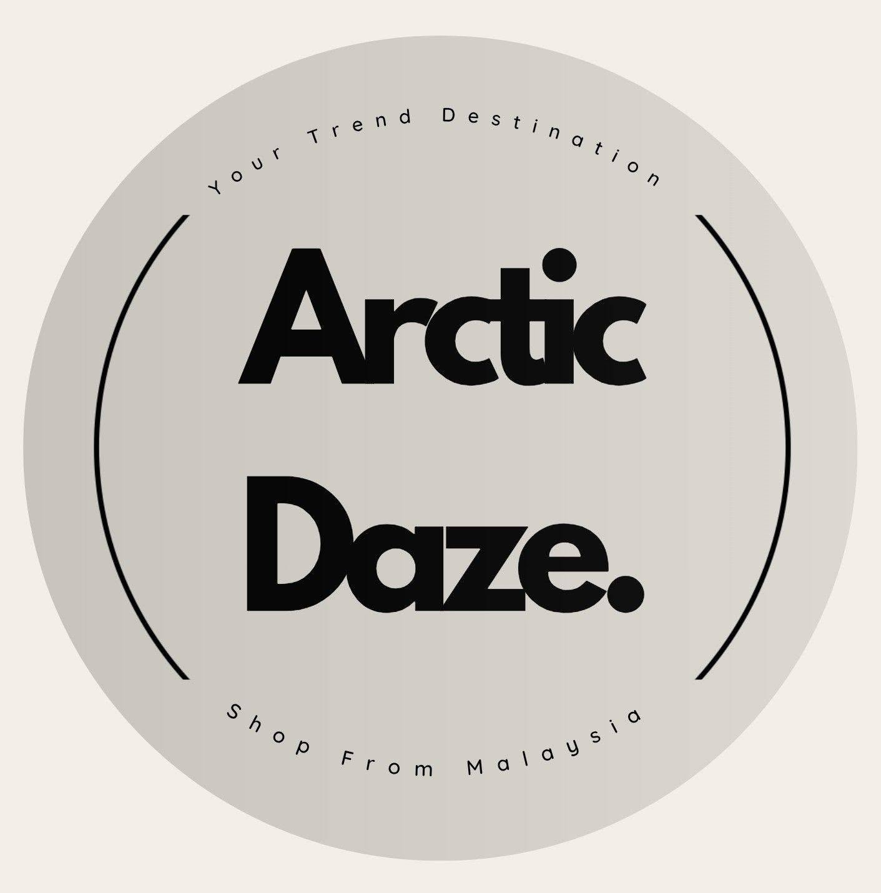
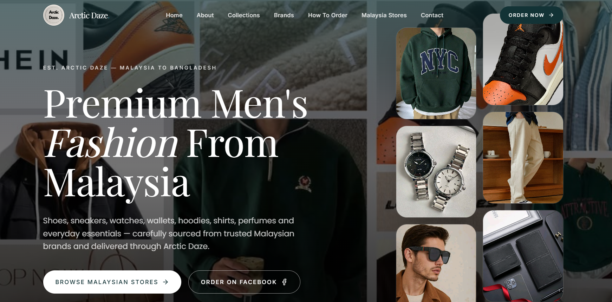

# Arctic Daze

<p align="center">
  
</p>

<h3 align="center">
Premium Men's Fashion • Malaysia to Bangladesh
</h3>

<p align="center">
A modern premium men's fashion sourcing platform that helps customers order authentic clothing, footwear, watches, accessories, grooming products and lifestyle essentials directly from trusted Malaysian retailers.
</p>

<p align="center">

[](https://arctic-daze.vercel.app/)
[](https://github.com/MahimKatha02/arctic-daze)

</p>

---

# 📸 Website Preview

<p align="center">
  
</p>
---

#  About Arctic Daze

Arctic Daze is a premium men's fashion sourcing service dedicated to bringing authentic Malaysian fashion to customers in Bangladesh.

From sneakers and watches to apparel, accessories and grooming products, Arctic Daze allows customers to shop directly from trusted Malaysian stores through a simple, transparent and reliable ordering process.

We simplify international shopping by providing:

- Authentic Malaysian Products
- Trusted Personal Shopping
- Premium Men's Fashion
- Secure Ordering
- Malaysia Shopping Support
- Fast Customer Service

---

# 📊 Business Overview

| Feature | Details |
|----------|----------|
| Business Name | Arctic Daze |
| Industry | Men's Fashion |
| Services | Personal Shopping & Import Service |
| Product Type | Men's Fashion & Accessories |
| Coverage | Malaysia to Bangladesh |
| Order Method | Facebook Messenger & WhatsApp |
| Response Time | Within 24 Hours |
| Customers | 500+ Repeat Customers |
| Categories | 12+ |
| Authenticity | 100% Authentic Products |

---

# 🚀 Live Website

### 🌐 Visit Here

https://arctic-daze.vercel.app/

---

# 👕 Product Collections

The website currently offers the following collections.

| Category | Description |
|-----------|-------------|
| Sneakers | Everyday icons |
| Shoes | Refined footwear |
| Watches | Timeless pieces |
| Sunglasses | Premium eyewear |
| Wallets | Leather accessories |
| T-Shirts | Cotton essentials |
| Shirts | Tailored fits |
| Hoodies | Elevated comfort |
| Pants | Modern cuts |
| Caps | Everyday accessories |
| Bags | Carry with confidence |
| Perfumes | Signature fragrances |

---

# ⭐ Why Arctic Daze?

✔ Authentic Malaysian Products

✔ Trusted Personal Shopper

✔ Premium Men's Fashion

✔ Fast Customer Support

✔ Secure Ordering

✔ Carefully Selected Brands

✔ Easy Facebook Ordering

✔ Affordable Import Service

---

# 🛍️ How Ordering Works

| Step | Process |
|-------|----------|
| 01 | Browse products from your favorite Malaysian shopping websites. |
| 02 | Copy the product link. |
| 03 | Send the product link via Facebook Messenger or WhatsApp. |
| 04 | Receive a transparent quotation including all costs. |
| 05 | Confirm your order and complete payment. |
| 06 | Sit back while Arctic Daze imports and delivers your order safely. |

---

# 🏬 Supported Malaysian Shopping Websites

Arctic Daze currently accepts orders from these trusted Malaysian retailers.

| Store | Category |
|--------|----------|
| SHEIN Malaysia | Fashion |
| Zalora Malaysia | Fashion |
| H&M Malaysia | Fashion |
| UNIQLO Malaysia | Fashion |
| Nike Malaysia | Sports |
| Adidas Malaysia | Sports |
| Puma Malaysia | Sports |
| Under Armour Malaysia | Sports |
| Shopee Malaysia | Marketplace |
| Lazada Malaysia | Marketplace |
| Fossil Malaysia | Accessories |
| Casio Malaysia | Watches |
| Seiko Malaysia | Watches |
| Charles & Keith Malaysia | Accessories |
| Sephora Malaysia | Grooming & Beauty |
| IKEA Malaysia | Home & Lifestyle |
| Guardian Malaysia | Personal Care |
| Watsons Malaysia | Grooming & Health |

---

# 🏷️ Featured Brands

The platform showcases products from internationally recognized brands including:

- Nike
- Adidas
- Puma
- Jordan
- New Balance
- ASICS
- Converse
- Vans
- H&M
- UNIQLO
- Zara
- Levi's
- Tommy Hilfiger
- Calvin Klein
- Fossil
- Casio
- Seiko
- Ray-Ban
- Oakley

---

# 📞 Contact Information

| Type | Details |
|------|---------|
| 👤 Owner | Mahim Chowdhury Katha |
| 👨‍💼 CEO | Akibul Hasan Arman |
| 📧 Email | thearcticdaze@gmail.com |
| 📱 Phone | +8801930647457 |
| 💬 WhatsApp | +8801930647457 |
| 📘 Facebook Page | https://facebook.com/arcticdaze11 |
| 👥 Facebook Group | https://facebook.com/share/g/1Fuxt4XBmG/ |

---

# 🛠️ Built With

| Technology | Purpose |
|------------|---------|
| React | Frontend Framework |
| TypeScript | Programming Language |
| TanStack Router | Routing |
| Tailwind CSS | Styling |
| Framer Motion | Animations |
| Lucide React | Icons |
| Vite | Build Tool |
| Vercel | Deployment |
| Git | Version Control |
| GitHub | Repository Hosting |

---

# 📂 Project Structure

```text
arctic-daze/
│
├── public/
│   ├── Arctic_Logo.jpg
│   ├── homepage.png
│   └── favicon.ico
│
├── src/
│   ├── assets/
│   │   ├── hero images
│   │   ├── collection images
│   │   ├── brand logos
│   │   └── product images
│   │
│   ├── routes/
│   ├── components/
│   └── styles/
│
├── package.json
└── README.md
```

---

# 📈 Website Features

- Fully Responsive Design
- Premium Editorial UI
- Modern Minimal Layout
- Animated Hero Section
- Smooth Scroll Navigation
- Product Collection Cards
- Interactive Brand Showcase
- Malaysian Shopping Directory
- Step-by-Step Ordering Timeline
- Facebook & WhatsApp Integration
- Contact Section
- Elegant Footer
- SEO Optimized

---

# 💻 Installation

Clone the repository

```bash
git clone https://github.com/MahimKatha02/arctic-daze.git
```

Go into the project

```bash
cd arctic-daze
```

Install dependencies

```bash
npm install
```

Run development server

```bash
npm run dev
```

Build production

```bash
npm run build
```

Preview production

```bash
npm run preview
```

---

# 🚀 Deployment

This project is deployed using **Vercel**.

Live Website

https://arctic-daze.vercel.app/

---

# 📌 Repository

GitHub Repository

https://github.com/MahimKatha02/arctic-daze

---

# 🎯 Business Mission

Arctic Daze aims to make international shopping easier, safer and more accessible by connecting customers in Bangladesh with authentic men's fashion and lifestyle products from trusted Malaysian retailers.

Every order is handled with transparency, reliability and customer satisfaction at its core.

---

# © Copyright

© 2026 Arctic Daze. All Rights Reserved.
